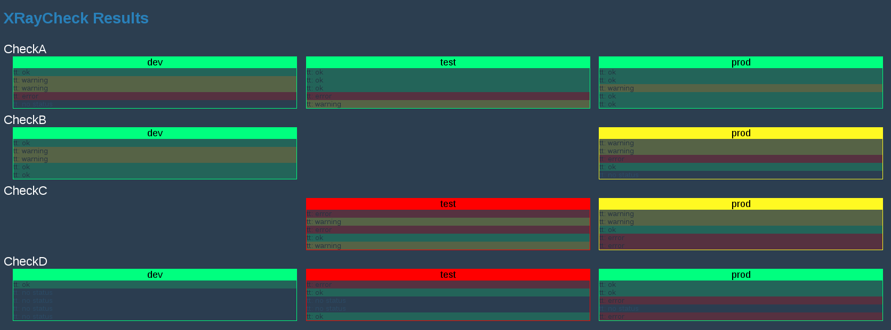

# tesla-xray
tesla-xray is a component for executing and visualizing checks.   
It can be used with the tesla-microservice.

		[de.otto/tesla-xray "0.2.2"]
  
Checks return Check-Results which currently look like this:

			{:status <ok/error>
			:message <your message>}
			
			(->XRayCheckResult :error "That is an error")

Checks can pretty much check/assert anything you like, implementation is up to you.
A unlimited number of custom-written-checks can be registered.
Registered checks are executed in a configurable time-schedule.
The check-results are stored and are visualized at an endpoint.   

Ideas for further features:  

	* ~~Visualization strategies (e.g. show red-status if a number of checks returned error)~~ (DONE)
	* App-Status which shows the status of registered checks
	* Graphs for registered checks (e.g. Execution times, status, ...)
	* Statistics on registered checks

## Usage
Add a xray-checker to your system:

		(:require [com.stuartsierra.component :as component]
				  [de.otto.tesla.xray.xray-checker :as checker]
				  [de.otto.tesla.system :as tesla])
					
		(-> (tesla/base-system {})
			(assoc :check (component/using (your-check/new-check) []))
			(assoc :xraychecker (component/using (checker/new-xraychecker "xraychecker") [:handler :config])))

`Your-Check` could look like this:

		(:require [com.stuartsierra.component :as component]
				  [de.otto.tesla.xray.xray-checker :as checker]
				  [de.otto.tesla.xray.check :as check])
				  
		(defn- default-strategy [results]
		  (:status (first results)))
		
		(defrecord YourCheck [xraychecker]
		  component/Lifecycle
		  (start [self]
			(checker/register-check-with-strategy xraychecker self "YourAwesomeCheck" default-strategy)
			self)
		  (stop [self]
			self)
		  
		  check/XRayCheck
		  (start-check [self environment]
			(if you-dont-care?
			  (check/->XRayCheckResult :none "I do not care!")
			  (if what-ever-you-like-to-check-is-an-error?
				(check/->XRayCheckResult :error "I found an error")
				(check/->XRayCheckResult :ok "Fromage")))))
